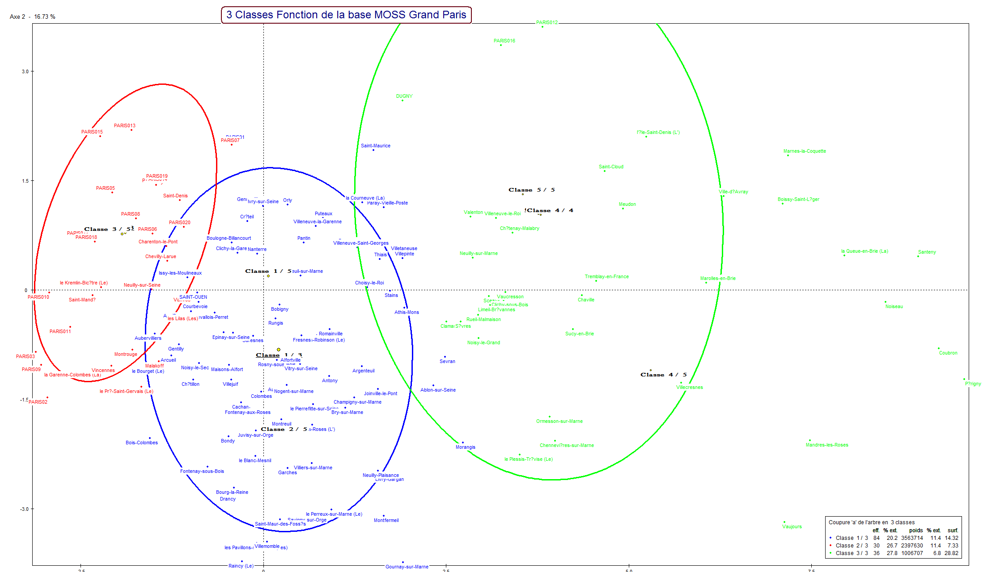
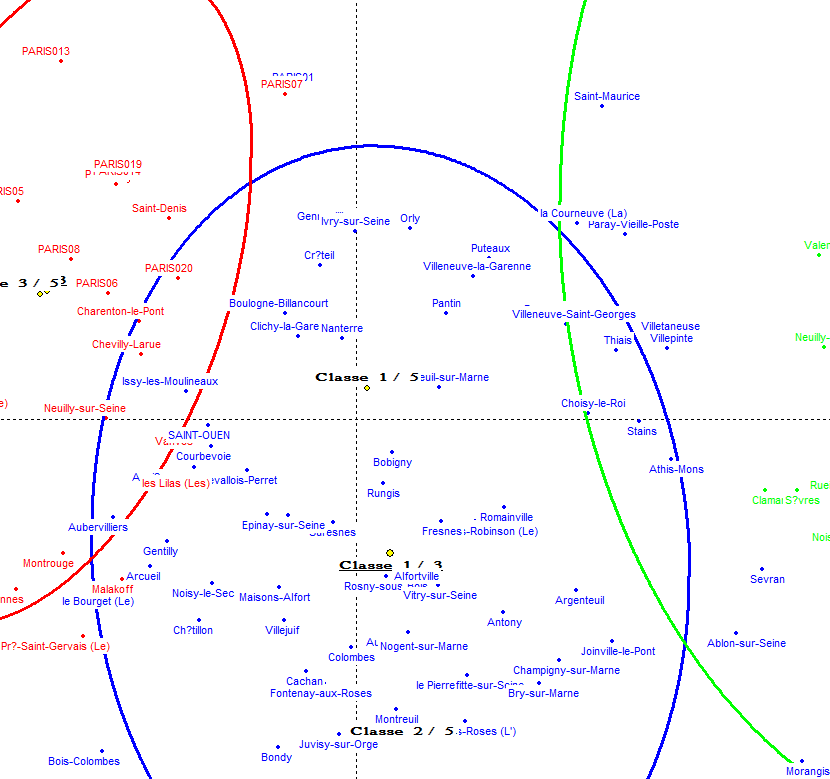
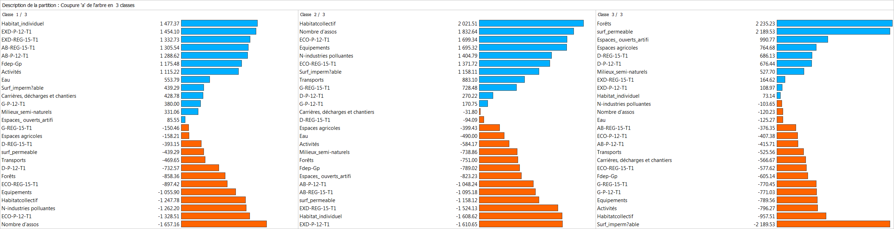
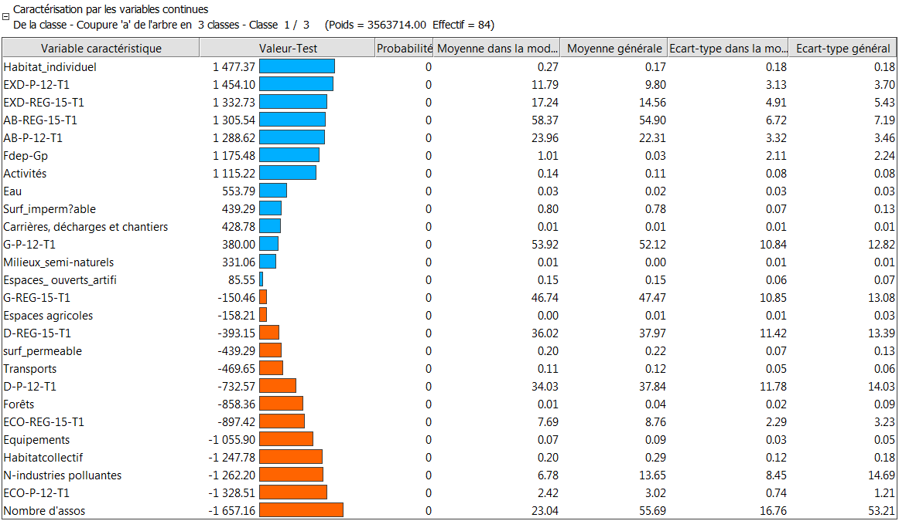
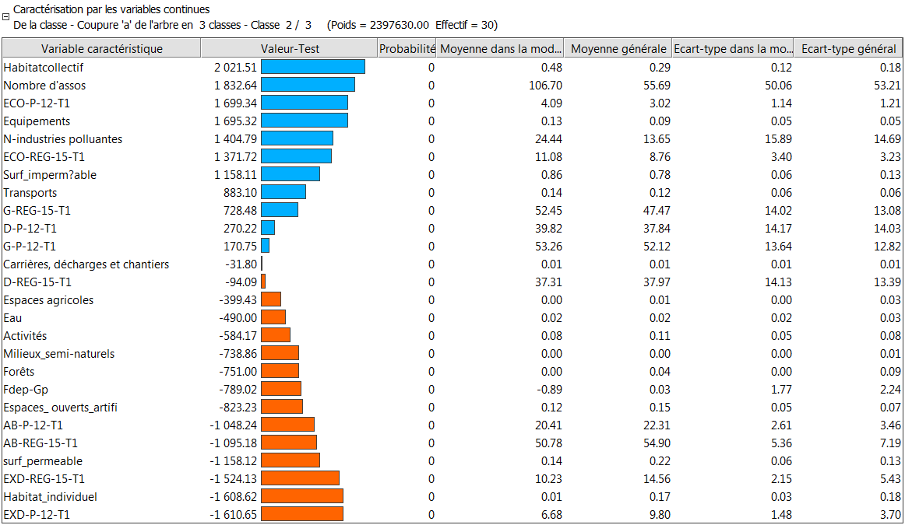
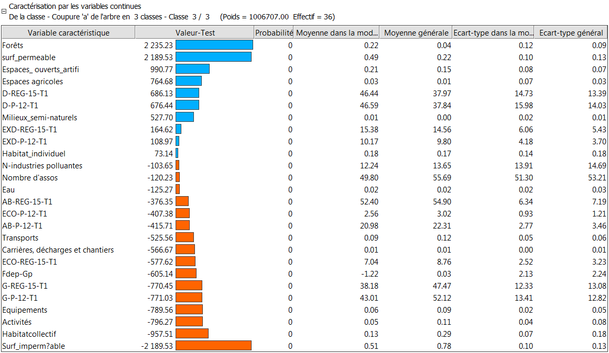
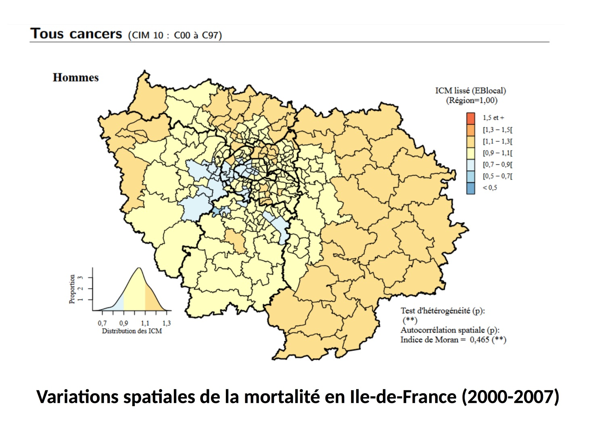
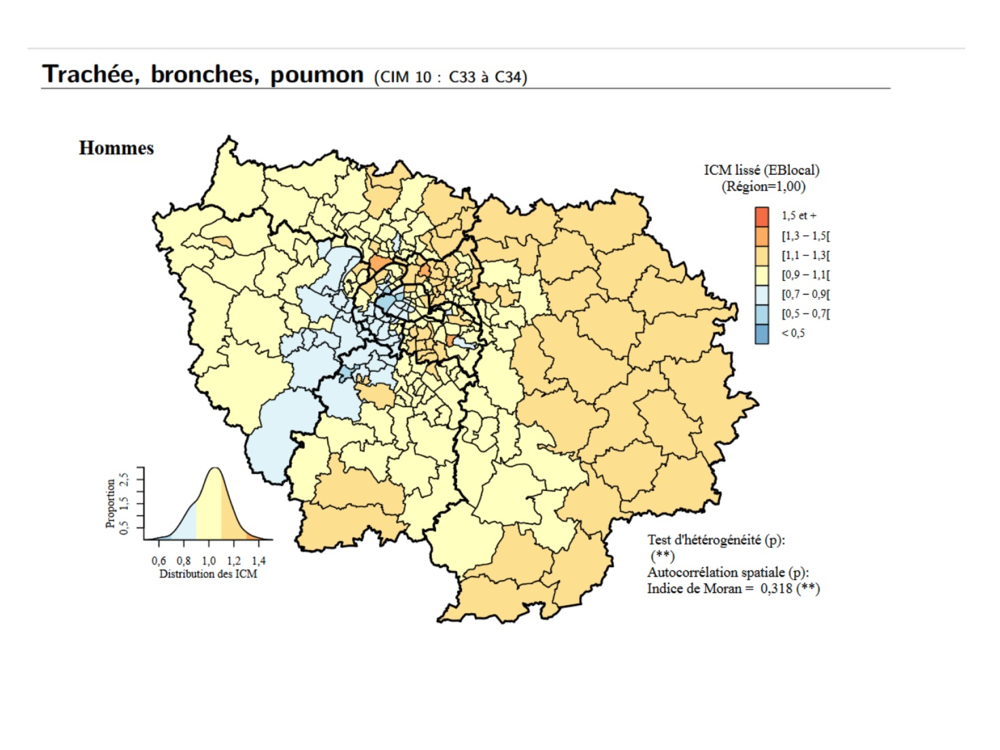
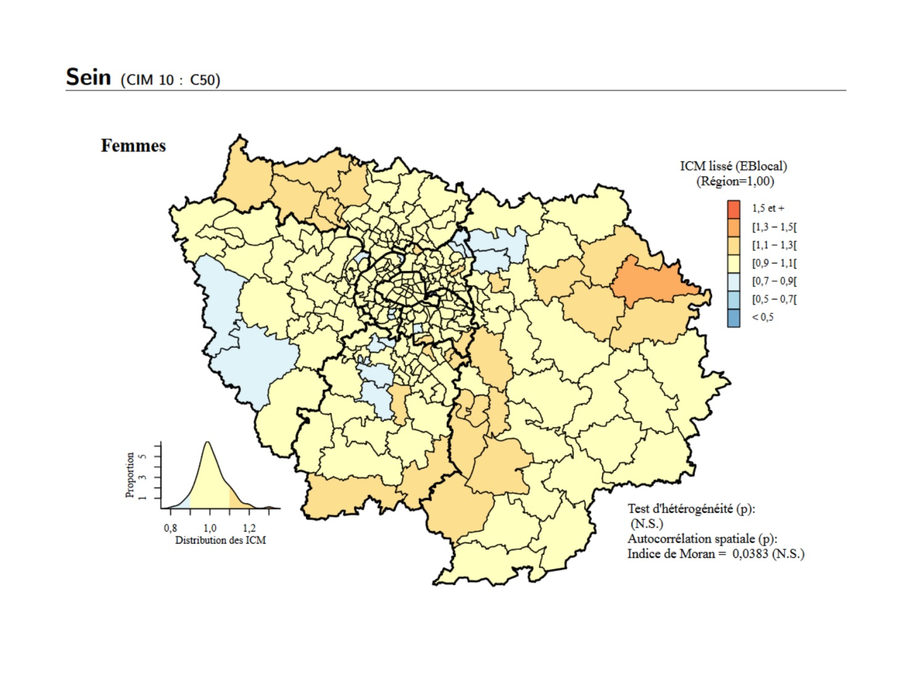

#CIVIC'ACT 
##CEVIPOF

-

These slides are online at [diegantobass.github.io/polearth](https://diegantobass.github.io/polearth/civicact/RCN_meeting/sampling_slides/index.html)

The huge survey on the presidential election that's taking all of our time at the Cevipof : <u>[www.enef.fr](http://www.enef.fr/)</u>

===

###Since December in Paris

- (The survey and the interviews)

- __The échantillonnage__, of CSOs based on territories

- MORE DATA, CSOs galore and health issues

- (some ERGMs maybe?)

===

(it means sampling)

#The échantillonnage
###how we choose which CSOS we want to interview

-
##The échantillonnage is
###1. Guide for the qualitative interviews
###2. Based on environmental data
###3. "Socio-politico-demographicaly coherent"

 

(+++ inter-disciplinary bonus points!)

===

###1. Guide for the qualitative interviews

- Need a reasonable number of CSOs to interview

- Need to be representative of territories and of people 

- Need to be driven by our hypothesises :
    + _Presence or absence of green space drives green votes_
    + _CSOs drive political implication_
    + _Bad health is linked to presence CSOs_
    + _Pollution drives far-right_
    + _[insert your question]_

===

###2. it is based on environmental data

- The [__MOS database__](https://www.data.gouv.fr/fr/datasets/mode-d-occupation-du-sol-mos-en-11-postes-en-2012-idf/) : _mode d'occupation des sols_

- Fine-grained spatial units : blocks, parks, buildings

- Sub-divided into 11 categories of land-use type

-

ACP (_principal component analysis_)   on the 11 variables of the MOS db for our _communes_.

CAH (_hierarchical clustering_)   to divide the geometricaly projected _communes_ into 3 classes

-

-

-

## Problems?

- Similar db for Strasbourg
- Reproduce that sampling on US data
- New CSOs data

===

###3. "Socio-politico-demographicaly coherent"

The hierarchical clustering was stopped at 3 classes with the _variables continues_ in mind.

We want to maximize intra-class coherence and inter-class heterogeneity

-

-

-

-

===

moaaarrrrrr

#MORE DATA
###some much data

-

###1. New database of CSOs just published
###2. Health data on cancer death

===

###1. New database of CSOs just published

Last week the government (of La France) released through its portal [data.gouv.fr](data.gouv.fr) a new dataset of [all CSOs ever](http://www.data.gouv.fr/fr/datasets/repertoire-national-des-associations-rna/)

I haven't yet explored the data

===

###2. Health data on cancer death

Mahdi contacts with the [INERIS](http://www.ineris.fr/) (_Institut National de l'EnviRonnement Industriel et des risqueS_) and [CepiDC](http://www.cepidc.inserm.fr/) (_centre d'épidémiologie sur les causes médicales de décès_) and his personal interest in health data

-

-

-

-

- Spatial scale is _canton_ (from INSEE) : higher scale than the the _communes_

- Temporal scale is 2000 to 2007, recent years and a long enough period to have sufficient cumulated data on the four types of cancer analysed

- Data include cause of death, age, sex, _commune_ where the person lived

===

Actualy no ERGMs