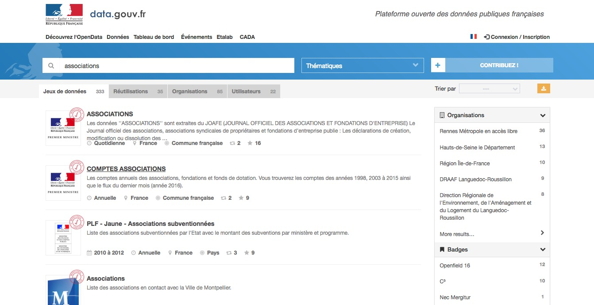
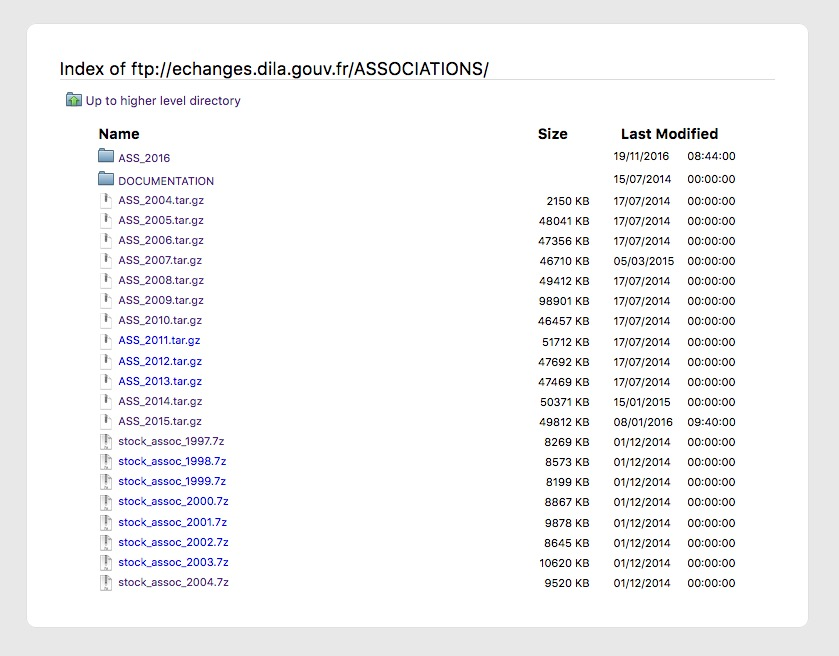
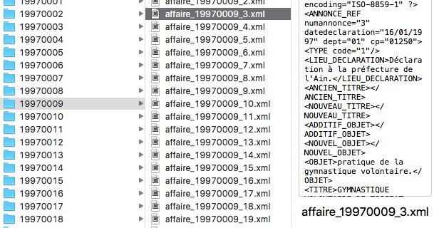
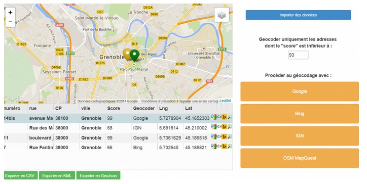

#Associations
###Database of french associations   published in the Journal Officiel

===

###Getting the data

-

 
Originaly in open data on [data.gouv.fr](https://data.gouv.fr)

-

Downloadable from the [DILA](http://www.dila.premier-ministre.gouv.fr/)'s ftp  
(Direction de l'information légale et administrative)

-

A couple of clicks latter, you get 895.867 files

===

###Cleaning the data

-

 
Convert from thousands of xml files to csv

-

Merge the two different databases with different format   
1997 to 2004 + 2004 to 2016

-

Filter assocations based on the zip code in their address   

- 27, Rue Edouard Vaillant - 93350, Le Bourget, France

- 11, Rue du Logis Vert - 79190, Caunay, France

-

Filter associations based on the thematic coding   

- code : intitulé
- 13000 : chasse pèche 
- 13005 : chasse 
- 13010 : pèche 
- 16025 : recherche sur l'environnement et le climat
- 23020 : associations d'exploitants agricoles
- 24000 : environnement cadre de vie
[...]

-

 
Geocoded with the [IGN France geocoder](http://www.ign.fr/)

-

Split associations along a timeline containing every major elections we had in France   
(When working on a given date, only associations created before that date should be considered, not the entire database of all associations between 1997 and 2016)

===

###Results

-

<iframe width="100%" height="520" frameborder="0" src="https://diegoantolinosbasso.carto.com/viz/3966e58e-b341-11e6-b562-0e3ff518bd15/embed_map" allowfullscreen webkitallowfullscreen mozallowfullscreen oallowfullscreen msallowfullscreen></iframe> 
(Disclaimer : only 4053 associations in the Grand Paris)

-

###Thanks
Slides availables at   diegantobass.github.io/civicact/asso_slides

